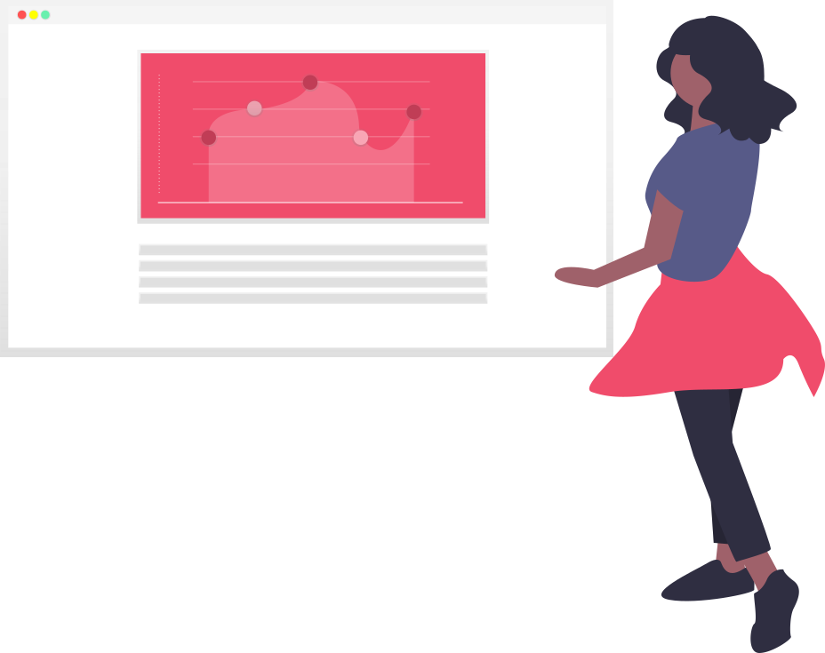
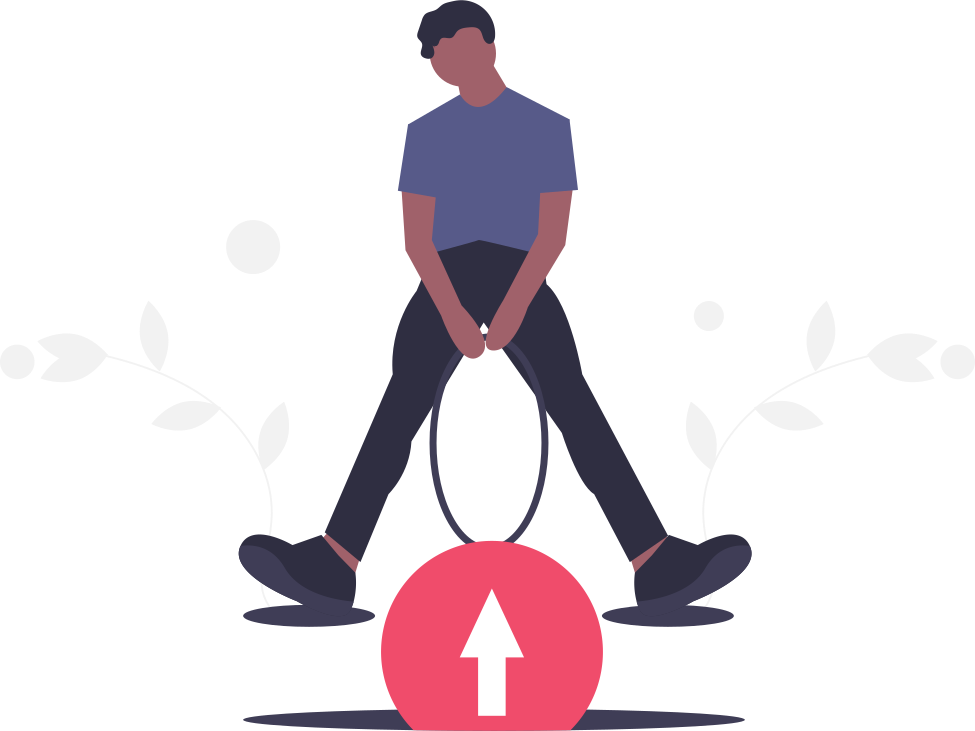
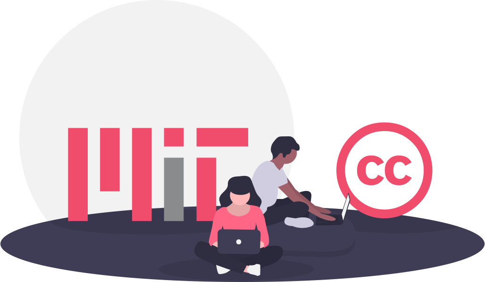

# :zap: Tips para optimizar tu web y convertirla en una PWA (Sysmana XII 2020) :zap:

<br/>


<br/>

### :closed_book: Presentación :closed_book:

Presentación asociada al taller [aquí](https://view.genial.ly/5e0f2007920b3b0f96ee8f03/presentation-genially-sin-titulo)

### :+1: Social :+1:

Twitter: [@susomejias](https://twitter.com/susomejias) , Portfolio: [susomejias.es](https://susomejias.es/inicio), Blog: [blog.susomejias.es](https://blog.susomejias.es)

## :warning: Prerrequisitos :warning:


- Disponer de unos conocimientos mínimos en **html, JavaScript, npm y CSS**.

- **Conexión a internet**.

- Disponer de un navegador web ya sea **[Chrome](https://www.google.com/intl/es_es/chrome/)(recomendado)** o firefox.

- Disponer de un **editor de código, recomendable** [Visual Studio Code](https://code.visualstudio.com/).

- Extensión [LiveServer](https://marketplace.visualstudio.com/items?itemName=ritwickdey.LiveServer) o similar para **Visual studio code**.

- [Node JS](https://nodejs.org/es/) instalado en tu equipo.

- [Npm](https://www.npmjs.com/get-npm) instalado en tu equipo.

## :exclamation: Introducción :exclamation:



Partiendo del proyecto contenido dentro de la carpeta **[withoutOptimizing](./withoutOptimizing)**, el cuál está construido sin tener en cuenta los **procesos de optimización adecuados**. En este taller se aplicarán **buenas prácticas** y conocimientos para optimizar este proyecto y convertirlo en un proyecto web optimizado y en una **PWA**. Obteniendo como resultado un proyecto similar al contenido dentro de la carpeta **[optimizing](./optimizing)**.


## :cyclone: ¡Al líooo! :cyclone:


1. **Librerías y fuentes.**

    - Accedemos a la carpeta **demo** que es una copia de la carpeta ```withoutOptimizing``` la cuál contiene el **proyecto sin optimizar** y que usaremos para realizar el taller.

    - Añadir **Tailwind, Font-awesome, Quicklink, AOS, Progressively, Google Font, mi CSS y mi JS**.

    - Añadir ```<script>``` después del renderizado del **DOM** o usando el atributo ```defer``` siempre que sea posible. Más info [aquí](https://cybmeta.com/diferencia-async-y-defer)

    - Para realizar los pasos anteriores copiamos dentro de nuestro ```<head>``` el contenido que se encuentra dentro de la etiqueta ```<head>``` del siguiente [archivo](./optimizing/index.html). 

2. **Minificar y concatenar assets.**

    - Instalar **Gulp** de manera **global** ```npm install -g  gulp```.

    - Usar **Gulp** para **minificar y realizar un lowly a las imágenes y minificar y concatenar**, **CSS** y **JS**. Para ello debemos copiar la carpeta **[gulptasks-automatization-master](./optimizing/gulptasks-automatization-master)** a la carpeta de la demo. Para ejecutar las **tareas de minificación y concatenación de assets** debemos de instalar previamente las dependecias con ```npm install``` e introducir el siguiente comando ```gulp``` dentro de la carpeta copiada anteriormente **```gulptasks-automatization-master```**.

3. **Implementar Tailwind, Progressively, AOS, Quicklink.**

    - [Tailwind](https://tailwindcss.com/), [Progressively](https://github.com/thinker3197/progressively), [AOS](https://github.com/michalsnik/aos), [Quicklink](https://github.com/GoogleChromeLabs/quicklink).

    - Copiamos dentro de nuestro ```<main>``` el contenido que se encuentra dentro de la etiqueta ```<main>``` del siguiente [archivo](./optimizing/index.html).

    - Añadimos inicializamos a nuestro archivo JS ```main.js```.

    ````
        {

            let init = function() {
                AOS.init(); // inicializamos AOS
                progressively.init(); // inicializamos progressively
                quicklink.listen({ priority: true }); // inicializamos quicklink
            }

            // ejecutamos función init al terminar la carga del DOM
            window.addEventListener('load', init)
        }
    ````
 
    
    
4. **Crear e importar Webmanifest.**
    - Documentación [aquí](https://developer.mozilla.org/es/docs/Web/Manifest).
    Para ello creamos un archivo en la raiz del proyecto llamado ```manifest.webmanifest``` y copiamos siguiente contenido:

    ````
        {
        "name": "tallerOptimizacionSysmana2020",
        "short_name": "tallerSysmana2020",
        "start_url": ".",
        "display": "standalone",
        "background_color": "#fff",
        "description": "Taller de optimización web Sysmana 2020.",
        "icons": [{
                "src": "assets/icons/icon-72x72.png",
                "sizes": "72x72",
                "type": "image/png"
            }, {
                "src": "assets/icons/icon-96x96.png",
                "sizes": "96x96",
                "type": "image/png"
            }, {
                "src": "assets/icons/icon-144x144.png",
                "sizes": "144x144",
                "type": "image/png"
            }, {
                "src": "assets/icons/icon-152x152.png",
                "sizes": "152x152",
                "type": "image/png"
            }, {
                "src": "assets/icons/icon-192x192.png",
                "sizes": "192x192",
                "type": "image/png"
            },
            {
                "src": "assets/icons/icon-384x384.png",
                "sizes": "384x384",
                "type": "image/png"
            },
            {
                "src": "assets/icons/icon-512x512.png",
                "sizes": "512x512",
                "type": "image/png"
            }
        ],
        "related_applications": [{
            "platform": "web",
            "url": "http://127.0.0.1:5500/demo/index.html"
        }]
        }
    ```` 

    - Añadir carpeta ```icons``` a nuestros assets. La carpeta la podremos encontrar dentro de los assets del proyecto ```optimizing```.

    - Añadir ```favicon.ico``` a la raíz de nuestra carpeta demo.


5. **Conversión a PWA.**

    - **Artículos recomendados**.
        1. Escribiendo Service Worker [aquí](https://pablomagaz.com/blog/escribiendo-service-workers-con-workbox).

        2. Workbox strategies [aquí](https://developers.google.com/web/tools/workbox/modules/workbox-strategies).

        3. ¿App Shell? [aquí](https://developers.google.com/web/fundamentals/architecture/app-shell?hl=es). 

    - **APP SHELL** *"lo necesario para que nuestro sitio funcione sin conexión a internet"*.

    - **Workbox** *"Workbox es la librería creada por Google que simplifica de forma notable la escritura de service workers mediante una API potente y sencilla."*

    - Apartado **Application** de Chrome (**Service Worker y Cache Storage**).

    - **Crear y registrar Service Worker** ```serviceWorker.js```. Para ello creamos un archivo en la raiz del proyecto llamado ```serviceWorker.js``` y copiamos el contenido del siguiente [archivo](./optimizing/serviceWorker.js). También debemos de registrarlo añadiendo el siguiente contenido a nuestro JS.

    ````
        {

            let init = function() {
                serviceWorkerRegister() // registramos serviceWorker
                AOS.init(); // inicializamos AOS
                progressively.init(); // inicializamos progressively
                quicklink.listen({ priority: true }); // inicializamos quicklink
            }

            let serviceWorkerRegister = function() {
                // Nos aseguramos que el navegador soporta la api 'serviceWorker'
                if ('serviceWorker' in navigator) {
                    // Registramos el service worker
                    navigator.serviceWorker.register('serviceWorker.js');
                }
            }

            // ejecutamos función init al terminar la carga del DOM
            window.addEventListener('load', init)
        }
    ````

    - Probar **Service Worker** sin conexión.

    - Instalar como **"App"**.


## Contributing



Please read [CONTRIBUTING.md](./CONTRIBUTING.md)  for details on our code of conduct, and the process for submitting pull requests to us.

## License



This project is licensed under the MIT License - see the [LICENSE](./LICENSE) file for details.

